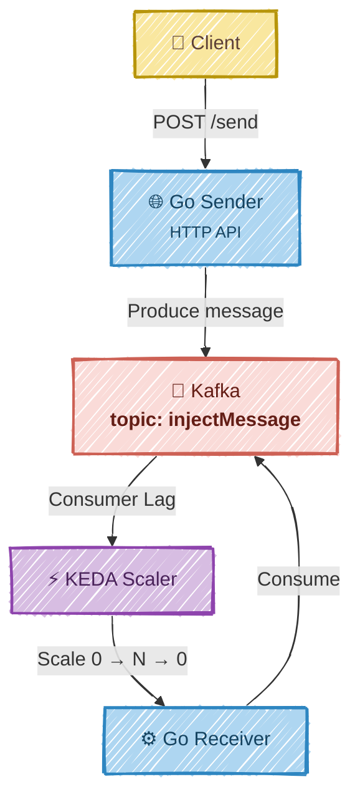

# 🚀 KEDA Kafka Go Demo

A minimal **Go + Kafka + KEDA** demo showing **event-driven autoscaling** based on Kafka consumer lag.

---

# 🏗️ Architecture



## Components

- 🌐 **go-sender**: HTTP API that publishes messages to Kafka.
- ⚙️ **go-receiver**: Kafka consumer automatically scaled by KEDA.
- 📨 **Kafka topic**: `injectMessage`
- 👥 **Consumer group**: `go-receiver-group`

---

# 📋 Prerequisites

- 🐳 Docker Desktop with Kubernetes enabled
- ☸️ `kubectl`
- ⚡ KEDA installed in the cluster

Install KEDA if needed:

```bash
helm repo add kedacore https://kedacore.github.io/charts
helm repo update
helm install keda kedacore/keda \
  --namespace keda \
  --create-namespace
```

---

# 🚀 Quick Start

Build the applications:

```bash
make build
```

Deploy everything:

```bash
make deploy
```

`make deploy` performs the following steps automatically:

1. 🐳 Deploy Kafka
2. ⏳ Wait for the Kafka deployment
3. 🔌 Wait for the Kafka broker API
4. 📨 Create the `injectMessage` topic
5. 🚀 Deploy sender and receiver
6. ⚡ Deploy the KEDA `ScaledObject`
7. 📊 Display deployment status

Expose the sender API:

```bash
make port-forward
```

Generate traffic:

```bash
make test
```

---

# 🎬 Watch KEDA Autoscaling

Open **k9s**:

```bash
k9s
```

Switch to the Pods view:

```text
:po
```

You should observe:

```text
🛌 Receiver scaled to 0

        │

📨 Send HTTP requests

        │

📈 Kafka lag increases

        │

⚡ KEDA creates a Receiver pod

        │

📥 Messages are consumed

        │

✅ Kafka lag becomes 0

        │

🛌 Receiver scales back to 0
```

---

# 🛠️ Useful Commands

```bash
make list-topics
make logs

kubectl get pods
kubectl get scaledobject
kubectl get hpa
kubectl get deploy go-receiver
```

---

# 💻 Manual Deployment

If you prefer not to use the Makefile:

```bash
docker build -t go-sender:1.0.0 -f Dockerfile.sender .
docker build -t go-receiver:1.0.0 -f Dockerfile.receiver .

kubectl apply -f k8s/k8s-kafka.yaml
kubectl rollout status deployment/kafka --timeout=180s

until kubectl exec deploy/kafka -- \
  /opt/kafka/bin/kafka-topics.sh \
  --bootstrap-server localhost:9092 \
  --list >/dev/null 2>&1; do
  sleep 2
done

kubectl exec deploy/kafka -- \
  /opt/kafka/bin/kafka-topics.sh \
  --bootstrap-server localhost:9092 \
  --create \
  --if-not-exists \
  --topic injectMessage \
  --partitions 1 \
  --replication-factor 1

kubectl apply -f k8s/k8s-sender.yaml
kubectl apply -f k8s/k8s-receiver.yaml
kubectl apply -f k8s/k8s-scaledobject.yaml

kubectl port-forward svc/sender-service 9999:9999
```

Generate traffic:

```bash
for i in $(seq 1 100); do
  curl -X POST localhost:9999/send \
    -H "Content-Type: text/plain" \
    -d "msg-$i"
done
```

---

# 🧹 Cleanup

```bash
make undeploy
```

---

# 🔧 Troubleshooting

## ❌ Pods show `ErrImageNeverPull`

This project uses:

```yaml
imagePullPolicy: IfNotPresent
```

Always build before deploying:

```bash
make build
make deploy
```

---

## ⚠️ KEDA shows `READY=False`

Inspect the KEDA operator:

```bash
kubectl logs -n keda deploy/keda-operator --tail=100
```

Verify:

- ✅ Kafka is running
- ✅ Topic `injectMessage` exists
- ✅ `bootstrapServers` points to the Kafka Service
- ✅ `offsetResetPolicy: earliest`

List Kafka topics:

```bash
make list-topics
```

---

## 📊 Verify Everything

```bash
kubectl get pods
kubectl get scaledobject
kubectl get hpa
```

Expected idle state:

```text
✅ Kafka Running
✅ Sender Running
😴 Receiver Scaled to 0
✅ ScaledObject READY=True
```

Expected after sending traffic:

```text
📨 Kafka lag increases
⚡ KEDA activates
🚀 Receiver starts
📥 Messages processed
😴 Receiver scales back to 0
```

---

# 🎥 Demo

The following video demonstrates the complete workflow:

- 🚀 Deploy the application
- 📨 Produce messages through the HTTP API
- ⚡ KEDA detects Kafka lag
- 📈 Receiver scales from **0 → 1**
- 📥 Messages are consumed
- 😴 Receiver automatically scales back to **0**
- 👀 Observe the entire process live using **k9s**

https://github.com/user-attachments/assets/a25d8a70-c946-4d61-85b2-7d131fa2353a

> 💡 The receiver pod is created only when Kafka lag exists and is automatically removed after all messages have been consumed.
