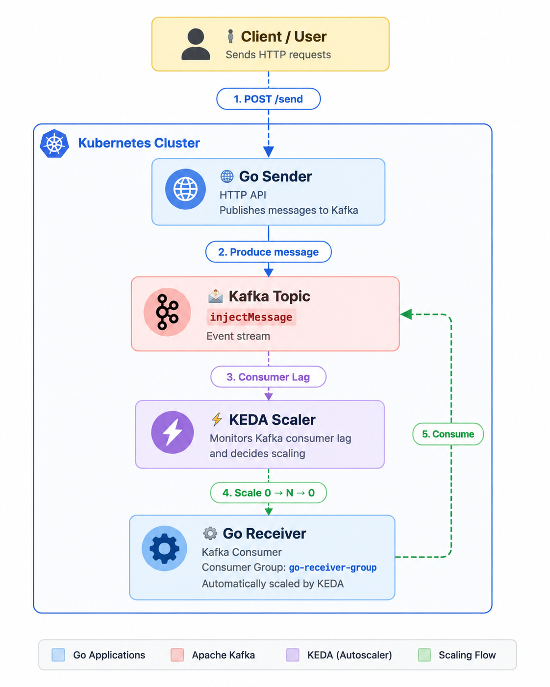

<p align="center">
  
</p>

<h1 align="center">KEDA Kafka Playground</h1>

<p align="center">
An Open Source Proof of Concept demonstrating event-driven autoscaling with KEDA and Apache Kafka.
</p>

<p align="center">


</p>

---

# 📖 Overview

This Proof of Concept demonstrates how **KEDA (Kubernetes Event-Driven Autoscaling)** automatically scales Kubernetes workloads according to **Apache Kafka consumer lag**.

The platform consists of two Go applications, an Apache Kafka broker and a KEDA `ScaledObject`.

As messages accumulate in Kafka, KEDA automatically creates consumer Pods. Once the queue has been processed, the consumer scales back down to **zero**, demonstrating true event-driven autoscaling.

---
# 🏗️ Architecture

<p align="center">
  
</p>

---

# 🧩 Components

### 📨 Go Sender

HTTP API responsible for publishing messages to Apache Kafka.

The sender exposes a simple REST endpoint that generates messages for the `injectMessage` topic.

---

### 📥 Go Receiver

Kafka consumer automatically scaled by **KEDA** according to Kafka consumer lag.

The receiver processes messages only when work is available and automatically scales down to zero once the queue has been emptied.

---

### 📨 Apache Kafka

Message broker used to decouple producers and consumers.

Topic:

```text
injectMessage
```

Consumer Group:

```text
go-receiver-group
```

---

### ⚡ KEDA

KEDA continuously monitors Kafka consumer lag and dynamically adjusts the number of receiver Pods.

When no messages remain, KEDA scales the deployment back to **zero**.

---

### ☸️ Kubernetes

Hosts the Kafka broker, Go applications and the KEDA Operator responsible for event-driven autoscaling.

---

# 🎯 Objective

This Proof of Concept demonstrates how to:

- Deploy KEDA on Kubernetes.
- Deploy Apache Kafka.
- Publish messages through a Go HTTP API.
- Automatically scale consumers based on Kafka lag.
- Scale workloads down to zero when no messages remain.
- Observe autoscaling using Kubernetes resources.
- Understand event-driven autoscaling principles.

---


# ⚙️ Prerequisites

- Docker Desktop (Kubernetes enabled)
- kubectl
- Helm 3
- Make
- Docker

---

# 📦 Install KEDA

Add the KEDA Helm repository:

```bash
helm repo add kedacore https://kedacore.github.io/charts
helm repo update
```

Install KEDA:

```bash
helm install keda kedacore/keda \
  --namespace keda \
  --create-namespace
```

Verify the installation:

```bash
kubectl get pods -n keda
```

Expected output:

```text
NAME                                          READY   STATUS
keda-admission-webhooks-xxxxx                 1/1     Running
keda-operator-xxxxx                           1/1     Running
keda-operator-metrics-apiserver-xxxxx         1/1     Running
```

---

# 🚀 Quick Start

Build the applications:

```bash
make build
```

Deploy the complete platform:

```bash
make deploy
```

The deployment automatically performs the following steps:

1. Build the Docker images.
2. Deploy Apache Kafka.
3. Wait until Kafka is ready.
4. Create the `injectMessage` topic.
5. Deploy the Go Sender.
6. Deploy the Go Receiver.
7. Deploy the KEDA `ScaledObject`.

Expose the Sender API:

```bash
make port-forward
```

Generate traffic:

```bash
make test
```

Follow the application logs:

```bash
make logs
```

Display the available Kafka topics:

```bash
make list-topics
```

---

# 🔍 Verification

Verify that all Pods are running:

```bash
kubectl get pods
```

Verify that the KEDA ScaledObject exists:

```bash
kubectl get scaledobject
```

Verify that the Horizontal Pod Autoscaler has been created:

```bash
kubectl get hpa
```

Verify the Receiver deployment:

```bash
kubectl get deployment go-receiver
```

Expected idle state:

```text
Kafka                 Running
Sender                Running
Receiver              Scaled to 0
ScaledObject          READY=True
```

---

# 🧪 Testing

Make sure the Sender API is exposed:

```bash
make port-forward
```

In another terminal, generate Kafka traffic:

```bash
make test
```

You can also generate traffic manually:

```bash
for i in $(seq 1 100); do
  curl -X POST localhost:9999/send \
    -H "Content-Type: text/plain" \
    -d "msg-$i"
done
```

Expected behavior:

```text
Kafka lag increases
KEDA activates the ScaledObject
Receiver scales from 0 to 1
Messages are consumed
Kafka lag returns to 0
Receiver scales back to 0
```

---

# 🎬 Observe Autoscaling

Open **k9s**:

```bash
k9s
```

Switch to the Pods view:

```text
:po
```

You should observe the following lifecycle:

```text
Receiver scaled to 0

        │

HTTP requests are sent

        │

Kafka lag increases

        │

KEDA creates a Receiver Pod

        │

Messages are consumed

        │

Kafka lag becomes 0

        │

Receiver scales back to 0
```

You can also observe autoscaling directly with kubectl:

```bash
kubectl get pods -w
```

In another terminal:

```bash
kubectl get hpa -w
```

And:

```bash
kubectl get scaledobject -w
```

---

# 🛠️ Troubleshooting

## Pods show ErrImageNeverPull

This project uses locally built Docker images.

If Pods show:

```text
ErrImageNeverPull
```

Build the images before deploying:

```bash
make build
```

Then redeploy:

```bash
make deploy
```

---

## KEDA shows READY=False

Inspect the KEDA operator logs:

```bash
kubectl logs -n keda deploy/keda-operator --tail=100
```

Verify that:

- Kafka is running.
- The `injectMessage` topic exists.
- `bootstrapServers` points to the Kafka Service.
- `offsetResetPolicy` is set correctly.

List Kafka topics:

```bash
make list-topics
```

---

## Receiver does not scale up

Verify the ScaledObject:

```bash
kubectl describe scaledobject
```

Verify the HPA:

```bash
kubectl describe hpa
```

Verify Kafka consumer lag by checking receiver logs:

```bash
make logs
```

---

# 🎥 Demo

The following video demonstrates the complete workflow:

- 🚀 Deploy the platform
- 📨 Produce messages through the HTTP API
- ⚡ KEDA detects Kafka consumer lag
- 📈 Receiver automatically scales from **0 → 1**
- 📥 Messages are processed
- 😴 Receiver automatically scales back to **0**
- 👀 Observe the complete lifecycle using **k9s**

https://github.com/user-attachments/assets/a25d8a70-c946-4d61-85b2-7d131fa2353a

> 💡 The Receiver Deployment only exists while Kafka lag is greater than zero. Once all messages have been processed, KEDA automatically scales the deployment back to zero.

---

# 📚 What You Will Learn

After completing this Proof of Concept, you will understand how to:

- Install KEDA using Helm.
- Deploy Apache Kafka on Kubernetes.
- Build event-driven applications.
- Configure a Kafka ScaledObject.
- Scale Kubernetes workloads based on Kafka consumer lag.
- Scale workloads down to zero when no work remains.
- Observe autoscaling using Kubernetes resources.
- Understand event-driven autoscaling patterns.

---

# 🧹 Cleanup

Remove all deployed resources:

```bash
make undeploy
```

If you deployed the resources manually:

```bash
kubectl delete -f k8s/k8s-scaledobject.yaml
kubectl delete -f k8s/k8s-receiver.yaml
kubectl delete -f k8s/k8s-sender.yaml
kubectl delete -f k8s/k8s-kafka.yaml
```

Uninstall KEDA:

```bash
helm uninstall keda -n keda

kubectl delete namespace keda
```

---

# 📚 References

- https://keda.sh/
- https://keda.sh/docs/latest/
- https://keda.sh/docs/latest/scalers/apache-kafka/
- https://kafka.apache.org/

---

# 🏛 About OpenMind Systems Lab

OpenMind Systems Lab is an independent French non-profit association dedicated to research, experimental development and technical benchmarking in Cloud Native technologies.

Our mission is to produce practical, reproducible and educational Open Source Proofs of Concept covering Kubernetes, Platform Engineering, Distributed Messaging, Infrastructure Security and Artificial Intelligence.

GitHub Organization:

https://github.com/openmind-systems-lab

---

<p align="center">
Made with ❤️ by OpenMind Systems Lab
</p>


